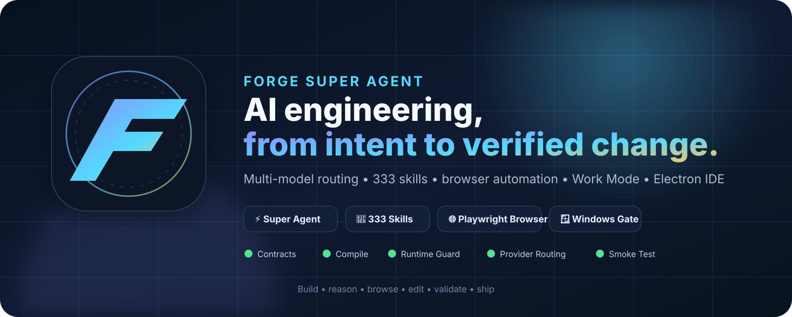
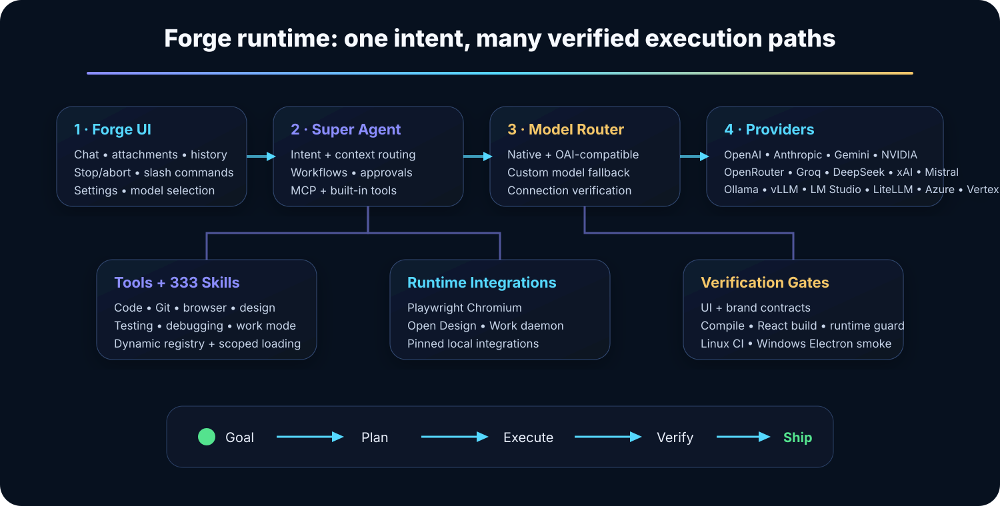
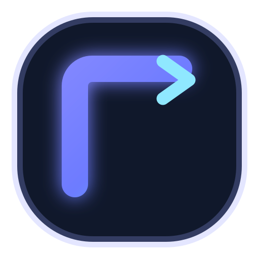

<p align="center">
  
</p>

<h1 align="center">Forge Super Agent</h1>

<p align="center">
  <strong>AI-native engineering studio for coding, browser work, automation, design, repository intelligence, and verified execution.</strong>
</p>

<p align="center">
  <a href="https://github.com/logeshv586-code/AICodeEngineer/actions/workflows/forge-ci.yml"></a>
  
  
  
  
</p>

<p align="center">
  <a href="#-quick-start">Quick Start</a> ·
  <a href="#-super-agent-capabilities">Capabilities</a> ·
  <a href="#-multi-model-provider-runtime">Models</a> ·
  <a href="#-slash-command-surface">Commands</a> ·
  <a href="#-verification--release-gates">Verification</a> ·
  <a href="#-architecture">Architecture</a>
</p>

---

## What is Forge?

**Forge** is an AI engineering environment built on the VS Code / Electron workbench architecture. It combines an IDE, conversational agent, tool runtime, browser automation, local integrations, a large skill registry, model/provider routing, execution controls, and release verification into one desktop workspace.

Forge is designed around a simple engineering loop:

> **Understand the goal → gather context → choose an execution path → use tools → verify the result → keep the user in control.**

Instead of treating AI as a side-panel chatbot, Forge wires AI work directly into the editor runtime: files, attachments, browser tasks, work queues, slash commands, model selection, stop/abort, tools, and verification all live in the same application.

---

## ✨ Super Agent capabilities

<table>
<tr>
<td width="50%" valign="top">

### 🧠 Super Agent orchestration

- Goal-oriented task execution
- Workspace-aware conversation context
- Adaptive model routing hooks
- Tool calls and MCP integration
- Safe stop/abort path for active runs
- Conversation duplication, history, feedback and recovery

</td>
<td width="50%" valign="top">

### 🧰 333-skill registry

- 333 registered skills in the library
- Small active runtime skill set
- Dynamic skill scoping instead of loading everything into context
- Validation contract for registry/path integrity
- Coding, Git, React, Electron, TypeScript, testing and routing skills

</td>
</tr>
<tr>
<td width="50%" valign="top">

### 🌐 Browser + research runtime

- Playwright Chromium installed by the Forge setup flow
- `/browser` Super Agent command path
- Browser/tool integration inside the desktop workflow
- Crawl4AI can be used as an **optional** Docker accelerator
- Docker is not required for Forge to launch

</td>
<td width="50%" valign="top">

### ⚙️ Work Mode + automation

- Local Work Mode scheduler
- Prompt/approval workflow queue
- `/work`, `/work-pending`, `/work-approve`, `/work-remove`
- PID-based daemon de-duplication
- Local state under the Forge user directory

</td>
</tr>
<tr>
<td width="50%" valign="top">

### 🎨 Design + engineering tools

- `/design` workflow surface
- Open Design local integration
- File/image attachments
- Repository and workspace tooling
- Git and testing workflows

</td>
<td width="50%" valign="top">

### 🛡️ Verification-first runtime

- Brand/UI contracts
- Provider/model routing contract
- Skill-library validation
- TypeScript compile gate
- React build gate
- Runtime artifact guard
- Linux CI + Windows Electron CI
- Final Windows desktop smoke launcher

</td>
</tr>
</table>

---

## 🚀 Quick Start

### Requirements

| Requirement | Recommended / required state |
|---|---|
| **OS** | Windows for the primary desktop release flow |
| **Node.js** | `20.18.2` — pinned by `.nvmrc` |
| **npm** | Installed with Node.js |
| **Git** | Required for pinned integration setup |
| **C/C++ build tools** | Required for native Electron/Node modules on Windows |
| **Docker** | Optional; only used for optional Crawl4AI startup |
| **Model credentials** | Needed only for the provider(s) you choose to use |

### 1. Clone

```bash
git clone https://github.com/logeshv586-code/AICodeEngineer.git
cd AICodeEngineer
```

### 2. One-time Forge setup

On Windows:

```bat
setup-forge-super-agent.bat
```

The setup script performs the release-grade local bootstrap:

```text
npm ci
  ↓
pinned integrations + supported dependency setup
  ↓
Playwright Chromium installation
  ↓
brand / UI / provider-model / Work Mode contracts
  ↓
333-skill validation
  ↓
TypeScript compile + React build
  ↓
runtime guard + active integration verification
  ↓
integration doctor + Super Agent self-test
```

### 3. Launch Forge

```bat
run-forge-ide.bat
```

### 4. Final Windows release smoke

```bat
smoke-forge-windows.bat
```

This command re-runs the automated gates, verifies the Electron executable, launches Forge, and prints the final interactive desktop checklist.

---

## 🤖 Multi-model provider runtime

Forge does **not** lock the application to a single vendor or a single hard-coded model. The current provider registry contains **17 provider paths**, and each registered provider is required by contract to have a chat transport implementation.

| Provider path | Runtime style | Model source |
|---|---|---|
| Anthropic | Native Anthropic SDK | Defaults + configured models |
| OpenAI | OpenAI SDK | Defaults + configured models |
| NVIDIA API | OpenAI-compatible | NVIDIA-hosted models |
| DeepSeek | OpenAI-compatible | DeepSeek models |
| Gemini | Native Google GenAI SDK | Gemini models |
| OpenRouter | OpenAI-compatible | OpenRouter catalog/custom names |
| Groq | OpenAI-compatible | Groq-hosted models |
| xAI | OpenAI-compatible | Grok models |
| Mistral | OpenAI-compatible + Mistral FIM path | Mistral/Codestral models |
| Ollama | Local OpenAI-compatible + native listing/FIM | Auto-detected local models |
| vLLM | Local OpenAI-compatible | Auto-detected/custom models |
| LM Studio | Local OpenAI-compatible | Auto-detected/custom models |
| LiteLLM | OpenAI-compatible proxy | Proxy-routed models |
| OpenAI-Compatible | Custom endpoint | User-supplied model names |
| Google Vertex AI | OpenAI-compatible Vertex path | Project/region models |
| Microsoft Azure OpenAI | Azure OpenAI client | Deployment/model name |
| AWS Bedrock | OpenAI-compatible gateway/proxy path | Gateway-routed models |

### “Any model” support — what Forge actually guarantees

Forge has two different levels of model compatibility:

1. **Static routing compatibility** — the provider/model contract verifies that every registered provider has a settings path, model registry entry, chat transport, connection-test route, and custom/unknown-model capability fallback.
2. **Live model availability** — the selected model must still exist at the provider, your credentials must be valid, the endpoint must be reachable, and the provider must support the requested API behavior.

That distinction matters: CI can prove Forge will route a configured provider/model correctly at the application layer, but CI cannot use or validate your private API keys.

### Before using a model

Inside Forge settings:

1. Configure the provider credentials or local endpoint.
2. Choose or add a model.
3. Use the provider/model **connection test** when available in the settings flow.
4. Select that model for Chat.
5. Send a small task before starting a long agent run.

---

## 🧭 Slash command surface

Forge exposes Super Agent workflows directly from chat.

| Command | Purpose |
|---|---|
| `/browser` | Browser/Playwright workflow |
| `/graph` | Graph / repository intelligence workflow |
| `/work` | Work Mode workflow |
| `/design` | Design workflow |
| `/health` | Forge health/status path |
| `/work-pending` | Inspect pending approval-gated Work Mode jobs |
| `/work-approve` | Approve a queued Work Mode action |
| `/work-remove` | Remove a queued Work Mode action |
| `/workflow,stop` | Abort the active Forge run |

The visible Stop control and workflow stop command are guarded to cancel the active run instead of sending another model message.

---

## 📎 Attachments and context

Forge supports staged context in chat, including file and image attachments. The conversation/runtime contracts preserve attachment-only sends so a user can attach context and execute a task without having to type artificial filler text.

The final Windows smoke explicitly checks:

- normal coding request
- file attachment
- image attachment
- active-run stop/abort
- `/browser`
- `/work`
- `/design`
- Forge desktop identity and taskbar icon

---

## 🏗 Architecture

<p align="center">
  
</p>

At a high level, Forge is split into five cooperating layers:

```text
┌─────────────────────────────────────────────────────────────────┐
│                         Forge Desktop UI                        │
│ Chat • history • attachments • settings • slash commands       │
└──────────────────────────────┬──────────────────────────────────┘
                               │
┌──────────────────────────────▼──────────────────────────────────┐
│                    Super Agent / Orchestration                  │
│ context • tools • MCP • Work Mode • browser • design           │
└───────────────────┬───────────────────────────┬─────────────────┘
                    │                           │
        ┌───────────▼───────────┐   ┌──────────▼───────────┐
        │ Model / Provider Layer│   │ Skills / Integrations│
        │ native + OAI-compatible│  │ 333 registry + local │
        └───────────┬───────────┘   └──────────┬───────────┘
                    │                           │
                    └────────────┬──────────────┘
                                 │
┌────────────────────────────────▼────────────────────────────────┐
│                       Verification Layer                        │
│ contracts • compile • React build • runtime guard • CI • smoke │
└─────────────────────────────────────────────────────────────────┘
```

### Important source areas

```text
src/vs/workbench/contrib/void/
├── common/
│   ├── modelCapabilities.ts        # Provider/model capabilities and fallbacks
│   ├── voidSettingsTypes.ts        # Provider settings + model state
│   └── sendLLMMessageTypes.ts      # LLM transport message contracts
│
├── electron-main/
│   ├── llmMessage/                 # Native + OpenAI-compatible model transports
│   └── forge/                      # Privileged Forge runtime/services
│
└── browser/react/src/
    ├── workspace-tsx/              # Forge chat/workspace UI
    └── void-settings-tsx/          # Provider/model settings UI

scripts/
├── forge-runtime-guard.mjs
├── forge-ui-contract-test.mjs
├── forge-brand-contract-test.mjs
├── forge-model-provider-contract-test.mjs
├── forge-work-self-test.mjs
├── forge-super-agent-self-test.mjs
├── forge-integrations.mjs
└── manage-skills.mjs
```

---

## 🧩 Pinned local integrations

Forge keeps supported third-party source integrations under:

```text
%USERPROFILE%\.forge\integrations
```

The lock file pins exact upstream commits for reproducibility.

| Integration | Role | Current phase |
|---|---|---|
| SkillOpt | Skill evolution / offline learning support | Active source integration |
| Understand Anything | Repository understanding / knowledge workflow | Active |
| Open Design | Local-first design tooling | Active |
| AionUi | Automation/cowork workflow integration | Active |
| Agent Lightning | Offline RL/training source | Source pinned; GPU/RL stack intentionally deferred |

Playwright Chromium is installed separately by the Forge bootstrap and is the supported browser runtime for normal `/browser` work.

---

## ✅ Verification & release gates

Forge treats regressions as contract failures rather than relying only on manual inspection.

### Fast contracts

```bash
node scripts/forge-brand-contract-test.mjs
node scripts/forge-ui-contract-test.mjs
node scripts/forge-model-provider-contract-test.mjs
node scripts/forge-work-self-test.mjs
node scripts/manage-skills.mjs validate
```

### Build verification

```bash
npm run compile
npm run buildreact
node scripts/forge-runtime-guard.mjs
```

### Integration verification

```bash
node scripts/forge-integrations.mjs verify active
node scripts/forge-integrations.mjs doctor
node scripts/forge-super-agent-self-test.mjs
```

### GitHub Actions

`Forge Agent CI` runs two release lanes:

- **Ubuntu:** native build prerequisites → `npm ci` → contracts → skills → compile → React build → runtime guard
- **Windows 2022 / VS2022:** `npm ci` with the supported native toolchain → the same contracts/build → Electron executable version check

The Windows lane is intentionally pinned to the VS2022 runner because the current native dependency chain uses `node-gyp@10.1.0`, which does not correctly identify the newer Visual Studio 2026 image.

---

## 🪟 Windows launcher behavior

`run-forge-ide.bat` performs startup safety checks before launching Electron.

- Node must be available.
- Forge Super Agent MCP registration is refreshed.
- Work Mode scheduler is started locally.
- Active integrations are checked.
- Runtime artifacts are validated.
- Missing Electron is treated as a blocking error with a clear setup recovery command.
- Docker is optional; if it is absent, Forge continues with the built-in Playwright browser path.

---

## 🧪 Development workflow

> Generated files under `out/` are build artifacts. Make source changes under `src/` and rebuild.

For normal Forge changes:

```bash
npm run compile
npm run buildreact
node scripts/forge-runtime-guard.mjs
```

For provider/model changes, also run:

```bash
node scripts/forge-model-provider-contract-test.mjs
```

For skill registry changes:

```bash
node scripts/manage-skills.mjs validate
```

For Windows release validation:

```bat
smoke-forge-windows.bat
```

---

## 🎯 Release philosophy

Forge uses layered evidence instead of a single “build succeeded” signal:

1. **Source contracts** protect UI wiring, brand identity, provider routing and workflow behavior.
2. **Compile/build gates** ensure TypeScript and React outputs are valid.
3. **Runtime guard** ensures generated/runtime artifacts are synchronized.
4. **Integration checks** validate the local Super Agent dependency state.
5. **Linux + Windows CI** catch platform-specific native build failures.
6. **Physical Windows smoke** verifies the final interactive Electron experience with real local credentials and models.

---

## 🗺 Roadmap direction

Current architecture is prepared for continued work in areas such as:

- richer provider/model health diagnostics
- deeper browser-agent observability
- stronger automated Electron interaction smoke tests
- expanded Work Mode scheduling flows
- improved repository intelligence and graph workflows
- optional offline learning/training with Agent Lightning
- packaging/release automation for signed desktop builds

---

## 🤝 Contributing

Contributions are welcome. For changes that touch Forge runtime behavior, please include the relevant contract or regression test whenever practical.

Recommended before opening a PR:

```bash
node scripts/forge-brand-contract-test.mjs
node scripts/forge-ui-contract-test.mjs
node scripts/forge-model-provider-contract-test.mjs
node scripts/forge-work-self-test.mjs
node scripts/manage-skills.mjs validate
npm run compile
npm run buildreact
node scripts/forge-runtime-guard.mjs
```

---

## 📜 License

This repository is licensed under the **Apache License 2.0**. See [`LICENSE.txt`](LICENSE.txt).

---

<p align="center">
  
</p>

<p align="center">
  <strong>Forge — build, reason, browse, edit, verify, ship.</strong>
</p>
